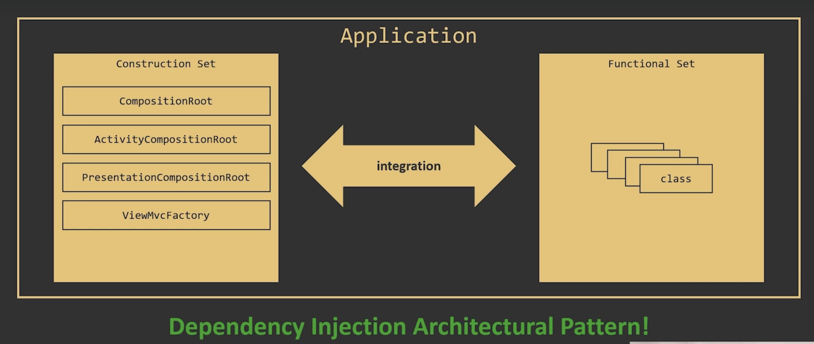
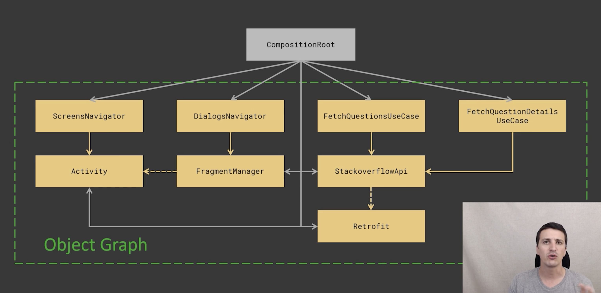
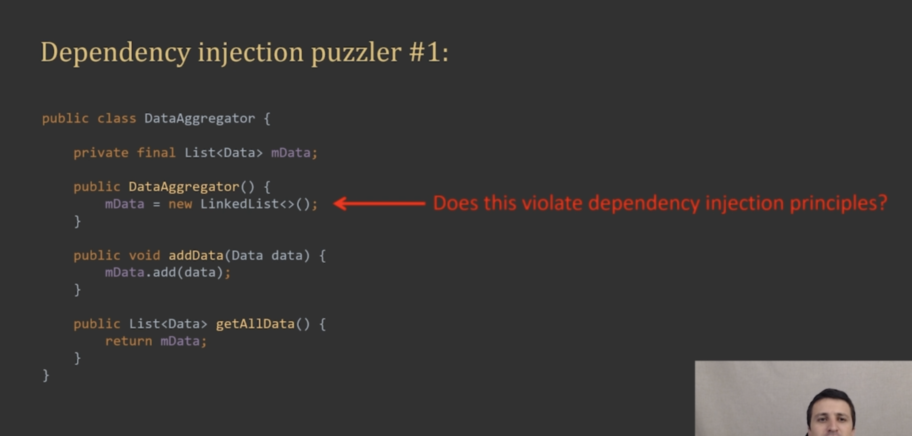

# AOS_Kotlin_dagger2_refactoring_project



# The Main Benefit of Dependency Injection



- **Non-repetitive definition and exposure of the entire object graph by composition root (both internally and externally) is the main benefit of Dependency Injection.**
- With Dependency Injection, you can keep your classes small and focused, but still easily compose them into arbitrary long chains to achieve complex functionality
- The main benefits of Dependency Injection is that it enables `Singe Responsibility Principle` and `Reusability`

### Context Isolation

- Protect all the services which I construct inside of composition, including all global services, all up scope services from being exposed to activity context `by design`. Therefore, we can prevent app from memory leaks associated with accidentally passing activity context into global objects.

# Objects vs Data Structures

### Objects

- exposes behavior

⇒ It's alright to construct data structures inside objects.

⇒ It's alright to return data structures from objects.

### Data Structures

- exposes data

⇒ Data structures can encapsulate other data structures

⇒ ❗️It's not alright to make your data structures dependent on other objects.

⇒ ❗️Data structures shouldn't know anything about objects

### Relevancy with Dependency Injection

- Dependency Injection Architectural Pattern deals with objects, not data structures.

### Quiz


⇒ This is alright, because List<Data> mData is not Object but Data Structure

# Refactoring Guide

- Application Scope, AppCompositionRoot
- Activity Scope, ActivityCompositionRoot
- Presentation Scope or Controllor Scope, PresentationCompositionRoot / Activities and Fragments
- One Activity or One Fragment => Mvc + Dialog + Network + Navigator

# Basic Refactoring

### Goals

- Activity ⇒ UserInterface + Network + Dialog + Navigator
- Extra Abstraction needed where there are code duplications ⇒ but be careful not to generalize too much.

### How does the code look after code separation?

```kotlin
private lateinit var viewMvc: QuestionListViewMvc
private lateinit var fetchQuestionsUseCase: FetchQuestionsUseCase
private lateinit var dialogsNavigator: DialogsNavigator
private lateinit var screensNavigator: ScreensNavigator
```

### Look how it seems

- QuestionsListActivity
  - ScreensNavigator ⇒ encapsulates screens management logic
  - QuestionsListViewMvc ⇒ encapsulates UI Logic
  - DialogsNavigator ⇒ encapsulates dialogs management logic
  - FetchQuestionsUseCase ⇒ encapsulates networking logic

### MVC

- QuestionsListActivity ⇒ Controller
- FetchQuestionsUseCase ⇒ Model
- QuestionsListViewMvc ⇒ View

# Law of Demeter

"Only talk to your immediate friends"

⇒ Make sure that it only uses the dependency that it really needs and it doesn't have other dependencies.

- Principle of least knowledge
- Minimize class dependencies
- Makes code more readable and maintainable

# Initialize value when called

```kotlin
@UiThread
class AppCompositionRoot {

    private var _retrofit: Retrofit? = null

    // init retrofit
    private val retrofit = if(_retrofit == null) {
        _retrofit = Retrofit.Builder()
                .baseUrl(Constants.BASE_URL)
                .addConverterFactory(GsonConverterFactory.create())
                .build()
        _retrofit!!
    } else {
        _retrofit!!
    }

    // init stackoverflow API
    public val stackoverflowApi = retrofit.create(StackoverflowApi::class.java)

    // Object should be stateful
    // When you want to share a object and multiple clients try to access it, that might be harmful.
    // However, if you put get(), this getter function will be invoked and will create a new instance of which questions to use.
    // `Just make sure you put `getter` when you want to make some object sharable between multiple clients.`
    public val fetchQuestionsUseCase get() = FetchQuestionsUseCase(stackoverflowApi)
    public val fetchQuestionDetailUseCase get() = FetchQuestionDetailsUseCase(stackoverflowApi)
}
```

# Using `lazy` keyword

- with global services, you need to use `lazy` keyword.
- when `lazy` is used for global scope ⇒ single instance.
- Whenever you want your services to be global, just use `lazy` keyword.

```kotlin
@UiThread
class AppCompositionRoot {

    private val retrofit: Retrofit by lazy {
        Retrofit.Builder()
                .baseUrl(Constants.BASE_URL)
                .addConverterFactory(GsonConverterFactory.create())
                .build()
    }

    // init stackoverflow API
    public val stackoverflowApi: StackoverflowApi by lazy {
        retrofit.create(StackoverflowApi::class.java)
    }

    // Object should be stateful
    // When you want to share a object and multiple clients try to access it, that might be harmful.
    // However, if you put get(), this getter function will be invoked and will create a new instance of which questions to use.
    // `Just make sure you put `getter` when you want to make some object sharable between multiple clients.`
    public val fetchQuestionsUseCase get() = FetchQuestionsUseCase(stackoverflowApi)
    public val fetchQuestionDetailUseCase get() = FetchQuestionDetailsUseCase(stackoverflowApi)
}
```

### `lazy` in different syntax

```kotlin
open class BaseActivity: AppCompatActivity() {
    val compositionRoot by lazy {
        ActivityCompositionRoot(this)
    }
}
```

⇒ In this case, `compositionRoot` which is created with `lazy` keyword, is not a singleton.

⇒ Activities which inherit BaseActivity will have its own `compositionRoot` for each activity.

# AppCompositionRoot

- Retrofit
- Stackoverflow API

# ActivityCompositionRoot

- Network UseCases

# Version Control

v.0.0.1

- Code Separation in `QuestionsListActivity` and `QuestionsDetailActivity`
- Base Class for removing code duplications on `QuestionsListMvc` and `QuestionsDetailMvc`

v.0.0.2

- FetchQuestionsUseCase
- FetchQuestionDetailUseCase

v.0.0.3

- DialogNavigator

v.0.0.4

- ScreenNavigator

v.0.0.5

- Share same retrofit instance using MyApplication

v.0.0.6

- passing stackoverflow api instead of retrofit

v.0.0.7

- Applied `Law of Demeter`

v.0.0.8

- Created app composition class in order to organize code for less dependency

v.0.0.9

- Global Service refactoring using `lazy` keyword and `get()` keyword

v.0.0.10

- Create AppCompositionRoot

AppCompositionRoot (Application Scope) <-> ActivityCompositionRoot(Activity Scope)

v.0.0.11

- refactored to fragment to show reusablility of MVC

v.0.0.12

- renamed `ActivityCompositionRoot` to `CompositionRoot` because `CompositionRoot` is shared between activity and fragment

v.0.0.13

- Another abstraction, created ViewMvcFactory and put it in `CompositionRoot`

v.0.0.14

- added new `fun newQuestionDetailsViewMvc(parent: ViewGroup?): QuestionDetailsViewMvc { return QuestionDetailsViewMvc(layoutInflater, parent) }`
- Nothing violates the law of demeter now.
- All the services app need are now in AppCompositionRoot and CompositionRoot
- Activity and Fragment don't know instantiation of each service

v.0.0.15

- Created `PresentationCompositionRoot` to create a new layer

v.0.0.16

- made `application context` available throughout activities & fragments in `ActivityCompositionRoot`

v.0.0.17

- made `data class` in order to represent `data structure` instead of behavior

### Now App has three layers

- App Layer
- Activity Layer
- Presentation Layer

### App Has now three scopes

- Application Scope, AppCompositionRoot
- Activity Scope, ActivityCompositionRoot
- Presentation Scope or Controllor Scope, PresentationCompositionRoot / Activities and Fragments

### Example of QuestionsListFragment

```kotlin
    private val coroutineScope = CoroutineScope(SupervisorJob() + Dispatchers.Main.immediate)
    private lateinit var fetchQuestionsUseCase: FetchQuestionsUseCase
    private lateinit var dialogsNavigator: DialogsNavigator
    private lateinit var screensNavigator: ScreensNavigator
    private lateinit var viewMvc: QuestionListViewMvc
    private var isDataLoaded = false

    override fun onCreate(savedInstanceState: Bundle?) {
        super.onCreate(savedInstanceState)
        fetchQuestionsUseCase = compositionRoot.fetchQuestionsUseCase
        dialogsNavigator = compositionRoot.dialogsNavigator
        screensNavigator = compositionRoot.screensNavigator
    }
```

=> If you apply this principle, just by reading properties on class, you can easily understand what the class does

=> Less dependency, it's all abstracted out on CompositionRoot
